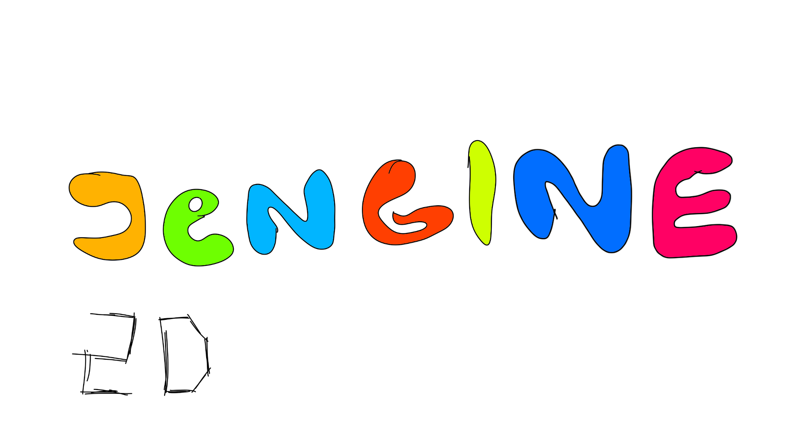

  

# Jengine-2d
Do you want to make Java game and don’t have enough knowledge? Than Jengine-2D is for you. Jengine-2D is simple java 2d engine for all types of games. It is easy to use and lightweight  
# Installation
- Download jengine-2d-"version".zip and unzip it
- Open your favourite IDE and create new project
- Add jengine-2d.jar to your project libraries
- Enjoy making game

Maratonec © 2020
